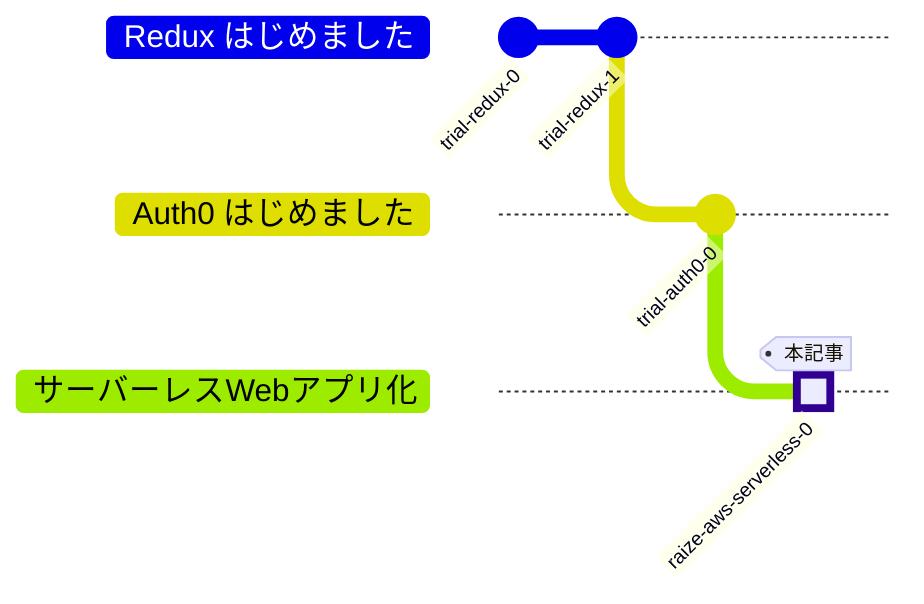

## 前回

https://zenn.dev/hilltop/articles/trial-auth0-0

## サーバーレスWebアプリ化 #0

Reduxで非同期処理書いてみたいなーと思ったのと、以前に頑張って使ってみたサーバーレスアーキテクチャのWebアプリの構築の復習を兼ねて今回も構築していこうと思います。

## 今回の目標

- 方針の書き留め
- 読者向けに背景などのメタ的なことの書き下し

## 0. 構成

*CloudCraftで書きました*

IaCとして `AWS SAM` を使います。  
SAMの実行環境もDocker上に建てます。

### 前提

- docker composeが動くところからスタート
- macOS上で試してます（難しいコマンドは使ってないので適宜読み換えてください）

### 段取り

AWS SAMは主にyamlファイルで構成要素を記述していきます。  
上記の構成を全て表現しようとすると、記述量も多いので記事を分割します。

### AWS SAMの前提知識

AWS SAM は AWS CloudFormation の「Serverlessアーキテクチャに特化したユーティリティ」のようなものです。

AWS SAMのデプロイの流れ
1. AWS SAM の記述ファイルを AWS CloudFormation の記述ファイルに変換
2. AWS CloudFormation のデプロイを実行
3. デプロイ対象のまとまりは `スタック` と呼ばれる単位で管理される

また、以下のような操作が可能です。
- 既にデプロイしたAWS SAM（CloudFormation）の記述を更新して再度デプロイすると、スタックから作成された構成要素に反映される
- スタックを削除すると、対応する構成要素も削除される

私の分割の考え方としては基本的に、「頻繁に更新される要素群はスタックを分ける」のですが、  
削除・更新の際に中身が入っているとうまくいかない物（DBやS3）の考慮も含まれてきます。

そして、構成要素の間の参照関係などもあるため、細かいパーツをどのスタックに含むべきかも悩ましいです。

## #1 DynamoDB編

### 担当範囲

- DynamoDBへのテーブルの作成
- IAMの設定の作成（各テーブルへの操作の認可の設定）

## #2 AppSync編

### 担当範囲

- GraphQLの機能を提供するAppSync
  - スキーマ設定
  - GraphQL接続時の認証用のロジック記述(今回はLambdaを使用)

## #3 Webアプリ編

### 担当範囲

- CloudFront
- S3バケット作成
- API Gateway
- CloudWatch

## まとめ

本記事としては何もしてないですが、記事を書くために裏ではかなり頑張りました。  
書ききれるといいなぁ……
