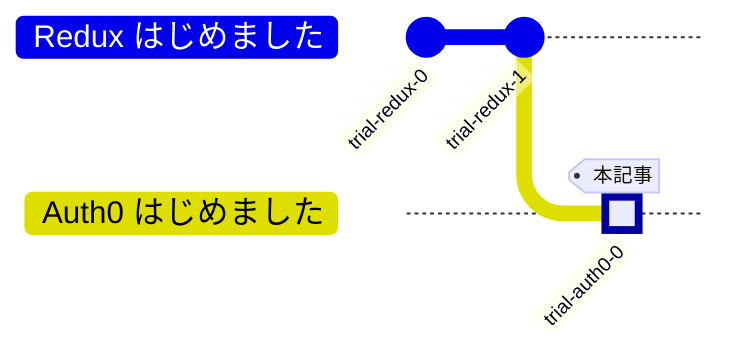

## 前回

https://zenn.dev/hilltop/articles/trial-redux-1

## Auth0 はじめました #0



2024年6月のAWS Summitのパートナーセッション^[AWSを活用している企業によるセミナー]にてOkta社による `Auth0` のプレゼンを拝見して興味があったので、 同サービスによるログイン画面の設置をしてみたいと思います。

当時どんなことを学んだかについては、まとめられた良い記事があったので貼っておきます。

https://dev.classmethod.jp/articles/aws-summit-okta-2024-kdpn/

## 今回の目標

これまでの記事で使ってきたプロジェクト（Vite + React on docker）にAuth0のログイン画面を設置してみます。

## 0. Auth0ざっくり理解

- ログイン画面って実は色々考えることがあって実装が大変
- 様々な認証方式が選択可能
- サービスの入り口で効率的なセキュリティ対策ができる
- Auth0を設置すればリダイレクトでいい感じのログイン画面を表示して認証認可の機能を肩代わりできる

### 参考にしたもの

https://zenn.dev/mayamashita/articles/5cd9cad37c69f0

*↑今回はこの記事に沿って設置作業を進めました*

https://auth0.com/docs/quickstart/spa/react/interactive

*↑Auth0公式のドキュメント（頑張って熟読するべし）*

https://dev.classmethod.jp/articles/auth0-architecture/

https://qiita.com/hisashiyamaguchi/items/2d0bcae052077f6ae4a4

## 1. Auth0に登録

ドメインとクライアントIDの発行が確認できたらOK  
（ドメインは任意の値も入力できたけど使い勝手がわからんのでデフォルト値にした）  
備忘録では後の動作の確認のために、この段階ではあえて動作に必要な入力を省きます。

## 2. React側

```sh:Auth0のReact向けパッケージをインストール
docker compose run frontend npm i @auth0/auth-react
```

```diff tsx:./frontend/src/main.tsxを編集
import { StrictMode } from 'react'
import { createRoot } from 'react-dom/client'
import App from './App.tsx'
import './index.css'
import { store } from './app/store'
import { Provider } from 'react-redux'
+import { Auth0Provider } from '@auth0/auth0-react'

+const domain = import.meta.env.VITE_AUTH0_DOMAIN
+const clientId = import.meta.env.VITE_AUTH0_CLIENT_ID

createRoot(document.getElementById('root')!).render(
  <StrictMode>
+    <Auth0Provider
+      domain={domain}
+      clientId={clientId}
+      authorizationParams={{
+        redirect_uri: window.location.origin
+      }}
+    >
      <Provider store={store}>
        <App />
      </Provider>
+    </Auth0Provider>
  </StrictMode>
)

```

ここで環境変数への参照をしてますが

```tsx:./frontend/src/main.tsxから抜粋
const domain = import.meta.env.VITE_AUTH0_DOMAIN
const clientId = import.meta.env.VITE_AUTH0_CLIENT_ID
```

このプロジェクトは Vite を使っているのでこういう書きっぷりになってます。  
環境変数の設置もここでやっておきます。

```env:./frontend/.envを作成
VITE_AUTH0_DOMAIN=Auth0から発行されたドメイン
VITE_AUTH0_CLIENT_ID=Auth0から発行されたクライアントID
```

```tsx:./frontend/src/components/login-button.tsxを作成
import React from 'react'
import { useAuth0 } from '@auth0/auth0-react'
import styled from 'styled-components'

const LoginButton: React.VFC = () => {
  const { loginWithRedirect } = useAuth0()

  return <Button onClick={() => loginWithRedirect()}>ログイン</Button>
}

const Button = styled.button`
  width: 150px;
  height: 50px;
  border-radius: 25px;
  background-color: #3bcee2;
`

export default LoginButton

```

```tsx:./frontend/src/components/logout-button.tsxを作成
import React from 'react'
import { useAuth0 } from '@auth0/auth0-react'
import styled from 'styled-components'

const LogoutButton: React.VFC = () => {
  const { logout } = useAuth0()

  return (
    <Button
      onClick={() => {
        logout({ logoutParams: { returnTo: window.location.origin } })
      }}
    >
      ログアウト
    </Button>
  )
}

export default LogoutButton

const Button = styled.button`
  width: 150px;
  height: 50px;
  border-radius: 25px;
  background-color: #db5c8d;
`

```

引用したソースによって `styled-components` が本プロジェクト上では初登場となりました。

```sh:styled-componentsをインストール
docker compose run frontend npm i styled-components
```

https://zenn.dev/syu/articles/0f92abf7f0b5c5

```diff tsx:./frontend/src/App.tsxを編集
import { useState } from 'react'
import reactLogo from './assets/react.svg'
import viteLogo from '/vite.svg'
import './App.css'
import { Counter } from './features/counter/Counter.tsx'
+import { useEffect } from 'react'
+import { useAuth0 } from '@auth0/auth0-react'
+import LoginButton from './components/login-button.tsx'
+import LogoutButton from './components/logout-button.tsx'


function App() {
  const [count, setCount] = useState(0)
+  const { isAuthenticated, user, isLoading } = useAuth0()
+
+  useEffect(() => {
+    console.log(JSON.stringify({isAuthenticated, user, isLoading}, null, 2))
+  }, [isAuthenticated, user, isLoading])
+
+  if (isLoading) {
+    return <div>Loading ...</div>
+  }

  return (
    <>
+      { isAuthenticated ? (
+        <>
+          <div>認証後</div>
+          <LogoutButton />
+          { user && <div>
+            
+            <h2>{user.name}</h2>
+            <p>{user.email}</p>
+          </div> }
+        </>
+      ) : (
+        <>
+          <div>認証前</div>
+          <LoginButton />
+        </>
+      ) }
      <div>
        <a href="https://vitejs.dev" target="_blank">
          
        </a>
        <a href="https://react.dev" target="_blank">
          
        </a>
      </div>
```

## 3. ローカルサーバーのHTTPS化

Auth0上に設定するURLはHTTPSじゃないといけませんでした。  
このタイミングでローカルサーバーのHTTPS化を実施します。

https://dev.classmethod.jp/articles/vite-https-localhost/

```sh:証明書を作成して配置
brew install mkcert
mkcert -install
mkcert localhost
mkdir ./frontend/https
mv localhost.pem ./frontend/https/
mv localhost-key.pem ./frontend/https/
```

```diff ts:./frontend/vite.config.tsを編集
import { defineConfig } from 'vite'
import react from '@vitejs/plugin-react-swc'
+import fs from 'fs'

// https://vitejs.dev/config/
export default defineConfig({
  plugins: [react()],
+  server: {
+    https: {
+      key: fs.readFileSync('./https/localhost-key.pem'),
+      cert: fs.readFileSync('./https/localhost.pem'),
+    }
+  },
})

```

```sh:fsを使えるようにする
docker compose run frontend npm i -D @types/node
```

## 4. 動作確認およびトラブルシューティング

:::message
本項は下記URLに載っているAuth0の必須項目の入力をサボった筆者の備忘録です。
https://auth0.com/docs/quickstart/spa/react/interactive#configure-auth0
品行方正な読者各位は生暖かい目で本項を見るか、スキップしてください。
:::


*ログインボタンを押してみます*


*おおっと？*

コールバックURLを設定することでこの挙動は直りました。


*いい感じです*

ところで、下記のおかげでAuth0の情報の読み込み中には `Loading ...` という表示が出るようになっているのですが、この状態が長すぎました。

```tsx:./frontend/src/App.tsx
  if (isLoading) {
    return <div>Loading ...</div>
  }
```


*1分以上はこの状態。長いぞ？*

これは許可されたWebオリジンを設定することで爆速になりました。

## まとめ

無事にAuth0のログイン画面を設置することができました。  
Auth0のダッシュボードの日本語化ができず必要項目を読み飛ばしてトラブルシューティングに時間を食ってしまいましたが、公式情報をきちんと読み直して最後にはちゃんとできたのでよかったです。  
軽く触ってみた感じ、2段階認証やスパム対策のCAPTCHAなどもAuth0側に設定すれば利用できました。    
イケてるログイン画面をお手軽に利用できるのは本当にありがたいです。
