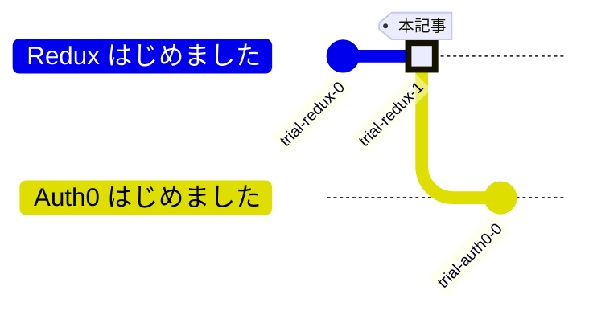

## 前回

https://zenn.dev/hilltop/articles/trial-redux-0

## Redux はじめました #1



やっぱGitHubリポジトリ作ります。  
普段はソースを作る前にリポジトリを用意するのですが、今回は既にソースありきの状態でリモートリポジトリに登録していきます。  
普段と違うリポジトリの用意の仕方なので、備忘録としての有用性が大！

## 今回の目標

GitHubリポジトリの作成（ローカルにソースありき）

## 0. 前提環境

- gitコマンドが動く
- GitHubリポジトリへのSSH接続の設定が済んでいる
  - `ssh -T git@github.com` コマンドで接続できればOK
- macOS上で試してます

## 1. リモートリポジトリ作成

https://github.com/new

後でソースコードが入ったローカルリポジトリをまるごとリモートリポジトリに push するので、  
ライセンスや .gitignore はこの段階では追加しません。


*リモートリポジトリの作成は非常に簡単*


*作成後はこのような画面になる*

## 2. ローカルリポジトリの作成・操作

前回の記事で作成したソースのフォルダを使います。

```sh:ソースフォルダのローカルリポジトリ化
cd redux-sample
git init
```

私はエディタとして IntelliJ IDEA を使っている関係で ./idea フォルダが作成されています。  
エディタ固有の設定が含まれるフォルダであり、今回はリポジトリ管理しないように .gitignore を追加します。
```gitignore:./.gitignoreを作成
.idea/*
```

```sh:コミット
git add .
git commit -m "Initial commit"
```

## 3. ローカルリポジトリとリモートリポジトリの紐付け


*GitHubの画面から、sshを選択して表示されるURLを使う*

```sh
git remote add origin git@github.com:HillTopTRPG/trial-redux.git
git remote -v
```

```sh:出力例
origin  git@github.com:HillTopTRPG/trial-redux.git (fetch)
origin  git@github.com:HillTopTRPG/trial-redux.git (push)
```

## 4. push

```sh
git push origin main
```

## 5. ライセンスの追加

`Add file` から `Create new file`


ファイル名に `LICENSE` と入力して...


`Choose a license template` を押す


テンプレートを選択する（GPLv3を選びがち）


`Review and submit` を押す


内容を確認して `Commit changes...` を押す


コミットコメントなどを入力して `Commit changes` を押す


*ライセンスを設定することができました*

ローカルリポジトリにも落として来ましょう

```sh
git pull origin main
```

```sh:出力例
From github.com:HillTopTRPG/trial-redux
 * branch            main       -> FETCH_HEAD
Updating e5529c0..2acc918
Fast-forward
 LICENSE | 674 ++++++++++++++++++++++++++++++++++++++++++++++++++++++++++++++++++++++++++++++++++++++++++++++++++++++++++++++++++++++++++++++++++++++++++++++++++++++++++++++++
 1 file changed, 674 insertions(+)
 create mode 100644 LICENSE
```

## まとめ

無事にソースありきのGitHubリポジトリ作成ができました。
いつもと違うアプローチで何かをやってみるというのも勉強になっていいですね。

## 次回

未定
